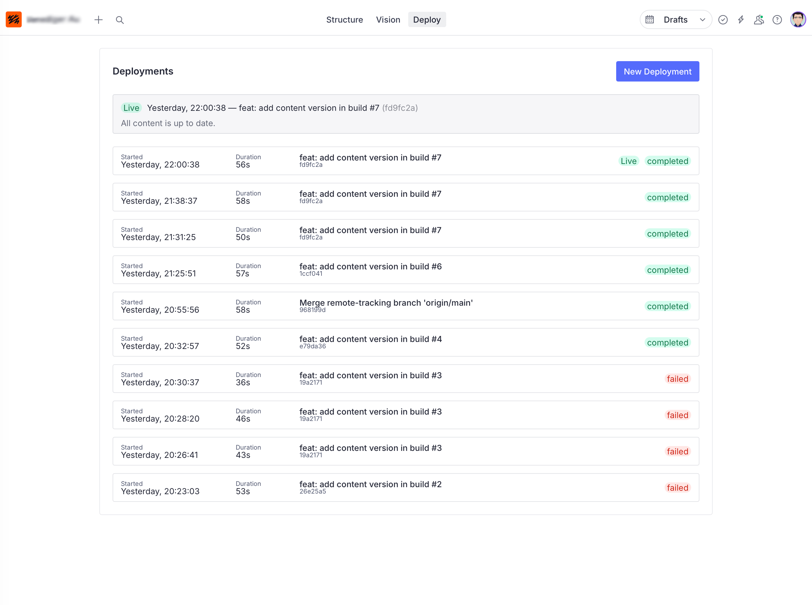
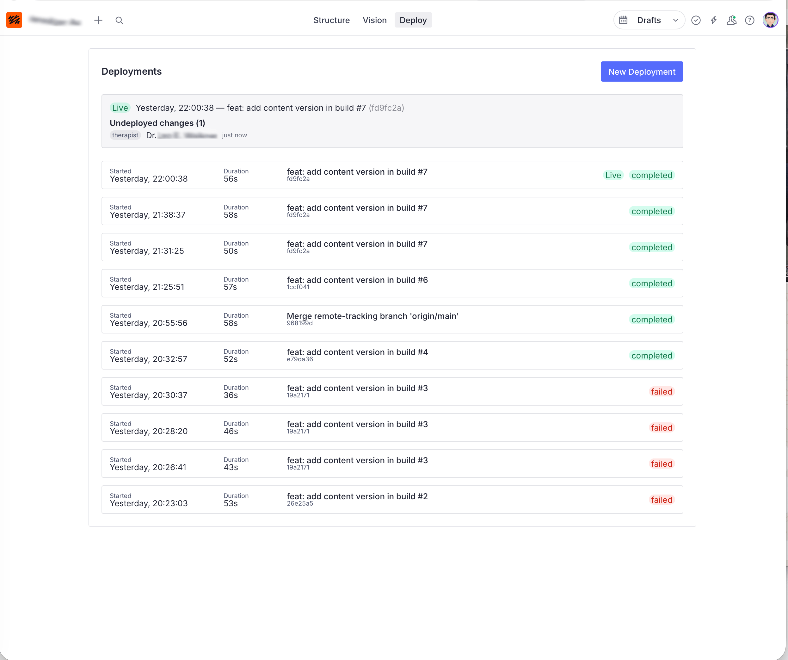
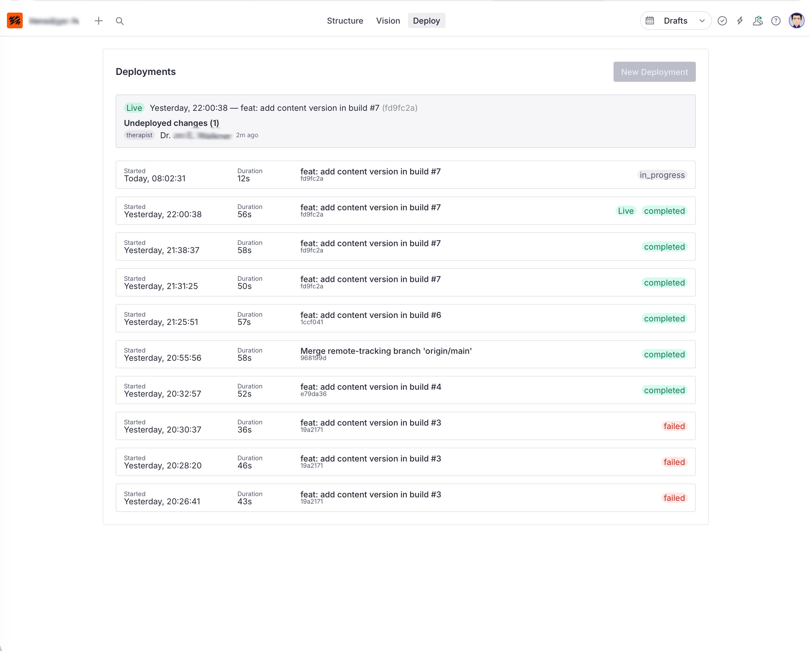

# sanity-plugin-github-deploy

[](https://www.npmjs.com/package/sanity-plugin-github-deploy)

A Sanity Studio plugin for triggering and monitoring GitHub Actions deployments directly from the studio.

## Motivation

Sanity offers powerful live content features and cache invalidation for frameworks like Next.js and Astro in SSR mode. But sometimes you just want a fully static site served from a CDN — zero runtime, zero maintenance, maximum performance.

In that setup, content changes don't go live until you rebuild and redeploy the site. This plugin gives editors a "Deploy" tab right inside Sanity Studio so they can trigger a full rebuild, deploy, and cache purge with a single click — no need to open GitHub or understand CI/CD.

## How It Works

The plugin uses **Sanity documents** and **webhooks** — no secrets are needed in the Studio.

- **Triggering a deploy:** The Studio writes a `deploy.trigger` document. A Sanity webhook fires and notifies the deploy proxy, which dispatches the GitHub Actions workflow.
- **Tracking status:** GitHub sends `workflow_run` webhook events to the deploy proxy, which writes `deploy.run` documents back to Sanity. The Studio reads these via GROQ.

```
Trigger flow:
  Studio ──create doc──▶ Sanity ──webhook──▶ Deploy Proxy ──dispatch──▶ GitHub
           deploy.trigger                                   GITHUB_TOKEN

Status flow:
  GitHub ──workflow_run──▶ Deploy Proxy ──mutate──▶ Sanity
           webhook event                            deploy.run docs
                                                    SANITY_TOKEN

Read flow:
  Studio ──GROQ──▶ Sanity API (native cookie/token auth)
```

## Preparation

Before using this plugin, you need:

1. A **GitHub Actions workflow** in your repository that handles the full deploy pipeline (build, upload, cache purge). The workflow needs a `workflow_dispatch` trigger.
2. A **deploy proxy** that receives webhooks from both Sanity and GitHub. See [Deploy Proxy Setup](#deploy-proxy-setup) below.
3. A **Sanity webhook** configured in [manage.sanity.io](https://manage.sanity.io) to notify the proxy when a deploy is triggered.
4. A **GitHub webhook** configured in your repository settings to notify the proxy of workflow run events.

## Features

- Display of current live deployment
- List of changed content (documents) since last live deployment
- Button to trigger a new deployment with progress indicator

### All content up to date



### Undeployed changes



### Deployment in progress



## Installation

```sh
npm install sanity-plugin-github-deploy
```

## Usage

Add the plugin to your `sanity.config.ts`:

```ts
import {defineConfig} from 'sanity'
import {deployTool} from 'sanity-plugin-github-deploy'

export default defineConfig({
  // ...
  plugins: [
    deployTool({
      // Optional: track undeployed changes for specific document types
      documentTypes: ['page', 'post', 'settings'],
      // Optional: GROQ expression for display title
      titleField: 'coalesce(title, name, _type)',
    }),
  ],
})
```

The plugin registers two document types automatically: `deploy.trigger` and `deploy.run`. No additional schema setup is needed.

## Configuration

### `DeployToolOptions`

| Option | Type | Required | Description |
|--------|------|----------|-------------|
| `documentTypes` | `string[]` | No | Document types to track for undeployed changes. Omit to disable. |
| `titleField` | `string` | No | GROQ expression for the title projection. Default: `coalesce(title, name, _type)` |

## Deploy Proxy Setup

The deploy proxy is a small server or edge function that receives webhooks from Sanity and GitHub. A reference implementation for **Bunny CDN Edge Scripting** is included in `edge/deploy-proxy.ts`.

### Proxy Environment Variables

| Variable | Description |
|----------|-------------|
| `GITHUB_TOKEN` | GitHub personal access token with `actions` scope |
| `GITHUB_WEBHOOK_SECRET` | Secret for validating GitHub webhook signatures |
| `SANITY_WEBHOOK_SECRET` | Secret for validating Sanity webhook calls |
| `SANITY_TOKEN` | Sanity API token with write access (for writing `deploy.run` documents) |
| `PROJECTS` | JSON string mapping repository full names to project config (see below) |

### `PROJECTS` Configuration

```json
{
  "your-org/your-repo": {
    "workflowId": "deploy.yml",
    "branch": "main",
    "sanityProjectId": "abc123",
    "dataset": "production"
  }
}
```

### Proxy Endpoints

| Method | Path | Description |
|--------|------|-------------|
| `POST` | `/sanity-webhook` | Receives Sanity webhook when `deploy.trigger` is created/updated, dispatches GitHub workflow |
| `POST` | `/github-webhook` | Receives GitHub `workflow_run` events, writes `deploy.run` documents to Sanity |

### Webhook Setup

#### Sanity Webhook (manage.sanity.io → API → Webhooks)

| Setting | Value |
|---------|-------|
| URL | `https://your-deploy-proxy.example.com/sanity-webhook` |
| Secret | Must match `SANITY_WEBHOOK_SECRET` env var |
| Filter | `_type == "deploy.trigger"` |
| Trigger on | Create, Update |

#### GitHub Webhook (Repository → Settings → Webhooks)

| Setting | Value |
|---------|-------|
| Payload URL | `https://your-deploy-proxy.example.com/github-webhook` |
| Content type | `application/json` |
| Secret | Must match `GITHUB_WEBHOOK_SECRET` env var |
| Events | Workflow runs |

## License

[MIT](LICENSE)
